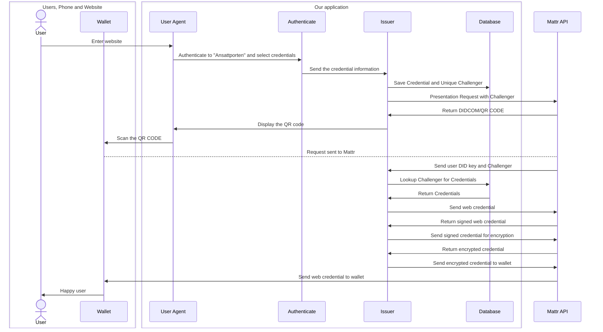

# Verifiable credentials Issuing

This repository contains an issuer for pre authentication in Mattr´s API. 

* [Mattr Verifier](#mattr-verifier)
* [Contributing](#contributing)
* [Overview](#overview)
  * [Presentation Flow](#presentation-flow)
  * [Prerequisite](#prerequisite)
* [Configuration](#configuration)
  * [.env data](#env-data)
  * [Ngrok](#ngrok)
  * [Mattr](#mattr)
    * [Fetch access token](#fetch-access-token)
    * [Create DID in Postman](#create-did-in-postman) 
    * [Create Presentation template in Postman](#create-presentation-template-in-postman)


### Mattr Verifier
The verifier is in another [Repository](https://github.com/felleslosninger/dc24-wallet-verifier).

### Contributing
See [CONTRIBUTING.md](CONTRIBUTING.md) for information about commit messages and more.

## overview
An implementation of a credential issuing service, using Mattr's API endpoints.

This service provide a way to fetch credentials from "ansattporten" using oauth2, these 
credentials are then saved and sent to a users' wallet. It contains information like rights,
name and more. This is not Mattr´s intended way to send out credentials! But it is a workaround as 
long as the Mattr's auth0 flow don't work with "ansattporten".

### Presentation Flow
Diagram displaying how the application communicate between the Issuer, user, wallet, API and etc.


### Prerequisite
Here is a list for needed technologies for development.
- [Ngrok](https://ngrok.com/); To let the callback get access to send back data.
- [Mattr API](https://mattr.global/); Need the API to be able to interact with their ecosystem.
- [Java](https://www.oracle.com/java/technologies/downloads/#jdk22-windows); Java 22 is needed to run the backend.
- [Maven](https://phoenixnap.com/kb/install-maven-windows); Guide for maven download and installation can be found


## Install and RUN:
To be able to run this project you need the prerequisites technologies, set environment variables and fetch values from Mattr´s API.
We assume you got a grasp of how Java and Maven work, and have an environment like VSC or Intellij to run this project in.

## Configuration
### .env data
Copy the [```.env.example```](src/main/resources/.env.example) file and rename the copy to ```.env```.
Then add your secret variables to the ```.env``` file, not the [```.env.example```](src/main/resources/.env.example) file.
```dotenv
MATTR_AUDIENCE=""               <-- Your audience data from Mattr
MATTR_TENANT_URL=""             <-- Your Tenent URL from Mattr
MATTR_ISSUER=""                 <-- Your auth url from Mattr
MATTR_CLIENT_SECRET=""          <-- Your client secret from Mattr
MATTR_CLIENT_ID=""              <-- Your client id from Mattr
ANSATTPORTEN_CLIENT_SECRET=""   <-- Your "ansattporten" client secret

NGROK_URL="/callback"           <-- The callback URL
DID_WEB=""                      <-- DID:web key from Mattr
TEMPLATE_ID=""                  <-- DID.Auth Presentation Template from Mattr
DOMAIN=""                       <-- Your domain, your Mattr tenent url without the "https://"
DID_WEB_EXTENSION=""            <-- The unique DID:web Key found under "localMetaData->initialDidDocument->keyAgreement->id" 
```

### Ngrok
Ngrok need to be installed on your machine, it can also be run in a docker container.
In short, it makes a port on your local machine accessible from the outside, and lets Mattr
send you the callback response.

Follow [This](https://ngrok.com/docs/getting-started/) tutorial to get it started, and use Port 8980,
it can be manually changed in the [application.yaml](src/main/resources/application.yaml) file.


### Mattr
How to create DID and Template ID. [Mattr API docs](https://learn.mattr.global/api-reference/latest)

#### Fetch access token
Auth server is the Mattr authentication server, you get this information from Mattr themselves.
- **HTTP Method** POST
- **URL:** ``{{AUTH_SERVER}}/oauth/token``
- **Headers:**
  - ``Content-Type: application/json``
- **Body:**
```json
{
  "client_id": "",
  "client_secret": "",
  "audience": "",
  "grant_type": "client_credentials"
}
```
Keep the "access_token" and reuse it in the Authorization fields.


#### Create DID in Postman
You can get the tenant url from Mattr.
- **HTTP Method** POST
- **URL:** ``{{TENANT_URL}}/core/v1/dids``
- **Headers:**
  - ``Content-Type: application/json``  
  - ``Authorization: Bearer YourAccessToken``
- **Body:**
```json
{
    "method": "web",
    "options": 
    {
        "url": "{{TENANT_URL}}"
    }
}
```
In the response you should keep the value, "did" and "id" found in:
```json
{
    "data": [
        {
            "did": "Your DID",
            "localMetadata": {
                "initialDidDocument": {
                    "keyAgreement": [
                        {
                            "id": "Your DID_WEB_EXTENSION"
                        }
                    ]                
                }
            }
        }
    ]
}
```

#### Create Presentation template in Postman
Domain is the same as you tenant URL, without the "https://"
- **HTTP Method** POST
- **URL:** ``{{TENANT_URL}}/v2/credentials/web-semantic/presentations/templates``
- **Headers:**
  - ``Content-Type: application/json``
  - ``Authorization: Bearer YourAccessToken``
- **Body:**
```json
{
  "name": "did-auth",
  "domain": "",
  "query": [
    {
      "type": "DIDAuth"
    }
  ]
}
```
In the response keep the id field.
Enter these values to the ``.env`` file.

